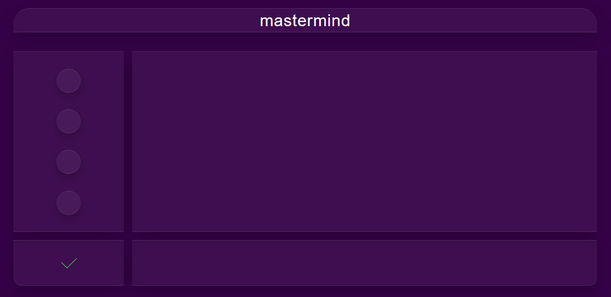
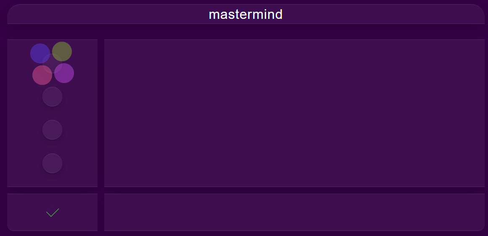
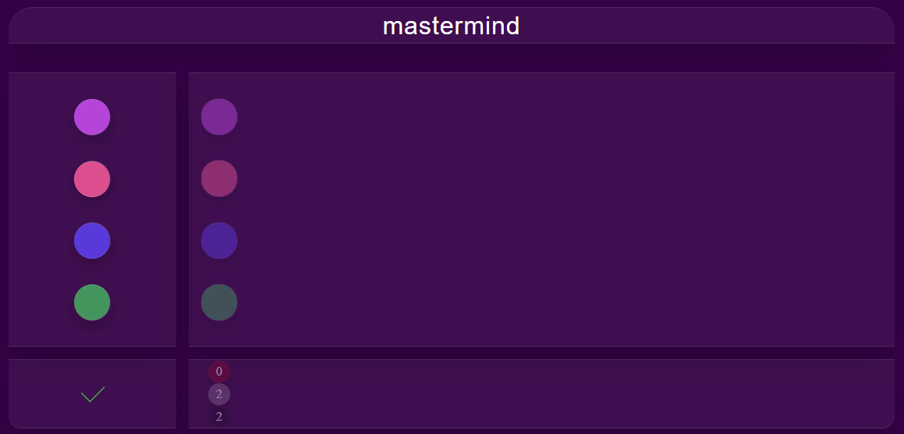
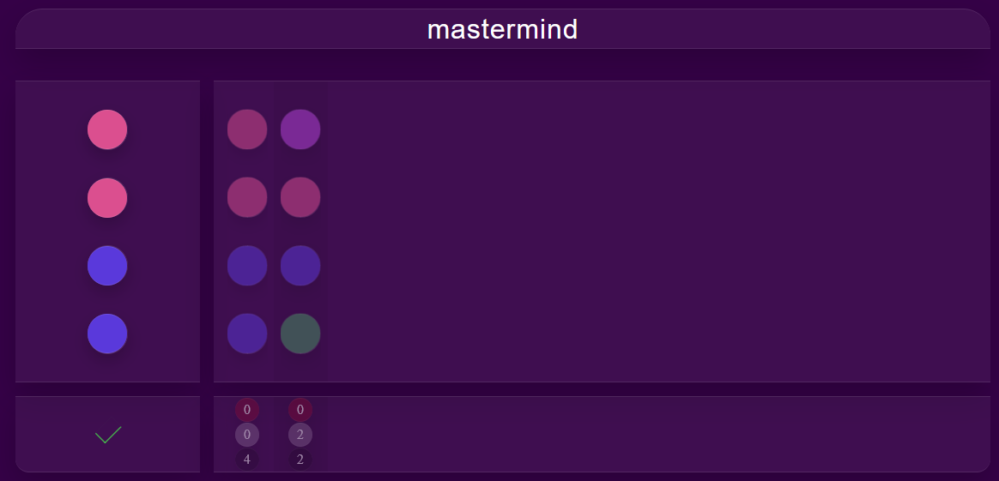

# MASTERMIND
:large_blue_circle: :black_circle: :white_circle: :red_circle:
Mastermind is a board game developed in the late 70s by Mordecai Meirowitz, an Israeli. This code-breaking game was designed for two players, nevertheless, virtual versions were created in which only a single player is needed. The virtual versions consist in that a machine generates a secret code with a combination of colors and gives you a certain number of tries to decipher it. For each attempt, the machine tells you the number of correct colors (white chips) and the number of chips that are the correct color and in the correct position (red chips). Colors can be repeated in the code, but no blanks can be left. The game ends when the player guesses the combination or when his attempts are finished. If the player guesses the combination, he wins and can play again with a different combination. This project makes part of the Holberton School pensum and consist in simulating a virtual Mastermind.

## Table of Content :bookmark:
* [Environment](#environment)
* [Installation](#installation)
* [File Descriptions](#file-descriptions)
* [Usage](#usage)
* [Bugs](#bugs)
* [Authors](#authors)

## Environment :gear:
This project devides in back and front, back is interpreted/tested on Ubuntu 14.04 LTS using Python3 (version 3.4.3) and front is designed on Javascript/CSS/HTML.

## File descriptions :page_with_curl:
#### `api/` directory contains backend for this project, this means that has the logic behind the game and contains an API to handle requests front-back and back-front:
[helper.py](/api/helper.py) - File has functions used as tools for the API.
* `def make_response(data=None)` - Creates the response json structure for specified data. 
* `def get_start_args(request)` - Retrieves and casts data from the URL related to starting the game
* `def get_move_args(request)` - Retrieves and casts data from the URL related to a move in the game
* `def st_save(id, data, db)` - Saves data to an specific id and storage
* `def st_get(id, db, key = None)` - Extracts data from an specific id

[index.py](/api/index.py) - File manages the roots of the API.
* `def start()` - Manages the /start route, gets the data to start the game, checks and saves, on the otherside it returns data for the front to display.
* `def check()` - Checks a game played by the playes and returns how many matches it had.
* `def not_found(error)` - Handles errors.

#### `src/` directory contains the frontend of this project, this means that has the static cintent, visual part of the project:
* [src](/src) - Directory with all the components of the visual page, css, html, js files.
* [data](/src/data) - Contains the colors and information about the programs front.
* [components](/src/components) - Directory with the objects that contains the static page.
* [audio](/assets/audio) - Audios for the different components of the program.

## How to play
1) To play you need to access to the webpage: http://34.75.178.179/mastermind/
   This is how initially would look the interface:
   
2) Then you can hover over the circles and select the colors:
   
3) Check the game you just selected and see how many matched
   
4) With the results, make a new guess (red are color and position match, white are color match and black are no match). This will appear on your left:
   
5) Continue making tries until you reach the end, you only have 10 tries! Good luck!

## Usage :computer:
1) Run 'npm install' command to install all necessary packages
2) To run the game choose one of the options:

* `npm run build:dev` - *to build your website in the development mode*
* `npm run build:prod` - *to build your website in the production mode (with minified CSS and JS)*
* `npm run start:dev` - *to run your website on the localhost using webpack dev server in the development mode*
* `npm run start:prod` - *to run your website on the localhost using webpack dev server in the production mode (with minified CSS and JS)*

3) This project is pre-configured to deploy to the firebase hosting (which is free). To be able to do this, create a new project using [firebase console](https://console.firebase.google.com/) and then:
* install firebase cli using `npm install -g firebase-tools` command
* initialize your new project using `firebase init` command (when asked, pick a hosting and set '**dist**' as a public directory)

4) To build and deploy your website to the newly created firebase hosting simply run command `npm run deploy`

## Bugs :ant:
No known bugs at this time.

## Authors :black_nib:
Juan David Avila - [Github](https://github.com/JuanDAC) / [Twitter](https://twitter.com/juanDAC_Dev)

Jerson Perez - [Github](https://github.com/jepez90) / [Twitter](https://twitter.com/Jepez90) 

Luis Mejia - [Github](https://github.com/lemejiamo) / [Twitter](https://twitter.com/Lemmishmaniasis)

Adriana Echeverri - [Github](https://github.com/adri-er) / [Twitter](https://twitter.com/AdrianaER219)

Daniel Escobar - [Github](https://github.com/dantereto) / [Twitter](https://twitter.com/Danielf05128222)
